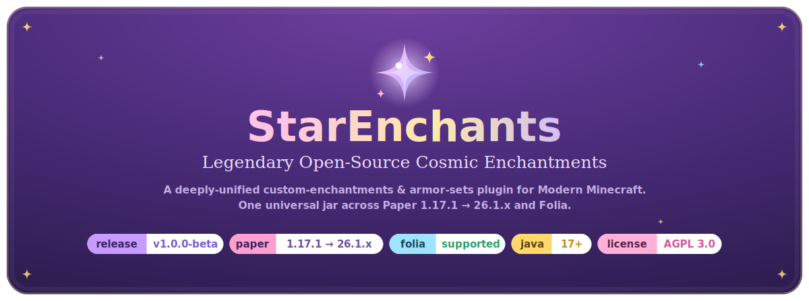

<!--
  ════════════════════════════════════════════════════════════════════════
  StarEnchants — README (developer-facing)
  ────────────────────────────────────────────────────────────────────────
  All player/operator docs (install, configuration, commands, the DSL
  reference, the Enchant Creator) live on the docs site, generated from the
  engine so they never drift. This README keeps only the title card + feature
  cards and developer information.

  GitHub strips <style>/CSS, so the visual styling lives in committed SVGs
  under /assets. To change colors, titles, the logo or icons read README-GUIDE.md.
  ════════════════════════════════════════════════════════════════════════
-->

<p align="center">
  <picture>
    <source media="(prefers-color-scheme: dark)" srcset="assets/hero-dark.svg">
    
  </picture>
</p>

<p align="center">
  <a href="https://github.com/owengregson/StarEnchants/releases/latest"></a>
  &nbsp;
  <a href="https://github.com/owengregson/StarEnchants/releases"></a>
</p>

<p align="center">
  <b>A single drop-in jar</b> — legendary, open-source cosmic enchantments for your server.<br>
  Custom enchantments, armor sets, crystals, and a full item economy under <b>one config schema</b>, with a built-in migrator.
</p>

<p align="center">
  <code>✦ 51 effects</code> &nbsp;&nbsp; <code>✦ Armor sets &amp; crystals</code> &nbsp;&nbsp; <code>✦ Souls economy</code> &nbsp;&nbsp; <code>✦ Paper + Folia</code> &nbsp;&nbsp; <code>✦ 1.8, 1.17.1 → 26.1.x</code>
</p>

<br>

<p align="center"></p>

<table>
<tr>
<td width="50%" valign="top">
<br>
<b>Unified effect engine</b><br>
Enchantments, armor-set bonuses, and crystals/modifiers all feed <i>one</i> engine: <b>51 effects</b>, <b>21 triggers</b>, <b>17 selectors</b>, and a conditions DSL over <b>40 live variables</b> — plus rarity tiers, applies/targets, and per-level options (chance, cooldown, souls, condition).
</td>
<td width="50%" valign="top">
<br>
<b>Item &amp; economy systems</b><br>
Enchant books, scrolls (white, holy-white, black, transmog, godly-transmog, randomizer), success dust, soul gems + a souls economy, slot-expander orbs, and item nametags.
</td>
</tr>
<tr>
<td width="50%" valign="top">
<br>
<b>Armor sets</b><br>
Full armour sets with a set-completion bonus and an optional matched set weapon, plus Heroic upgrades that boost damage, reduction &amp; durability — each just another source of effects feeding the same engine.
</td>
<td width="50%" valign="top">
<br>
<b>In-game GUIs</b><br>
Enchanter, alchemist, tinkerer, transmog, and browser menus (enchants, sets, crystals, and the live DSL reference) — open any with <code>/se menu</code>.
</td>
</tr>
<tr>
<td width="50%" valign="top">
<br>
<b>Integrations</b><br>
WorldGuard, Towny, Lands, SuperiorSkyblock, Factions, Vault, PlaceholderAPI, Mental, GrimAC, mcMMO, MythicMobs, ItemsAdder &amp; Oraxen — all bundled in the one jar, all optional, none required.
</td>
<td width="50%" valign="top">
<br>
<b>Built-in migrator</b><br>
Bring your existing EliteEnchantments, EliteArmor &amp; AdvancedEnchantments configs straight into the unified schema — one command, <code>/se migrate</code>.
</td>
</tr>
</table>

<br>

<p align="center">
  <b>📖 Installation, configuration, commands, the full reference &amp; an interactive Enchant Creator live on the docs site:</b>
</p>
<p align="center">
  <a href="https://owengregson.github.io/StarEnchants/"><b>owengregson.github.io/StarEnchants&nbsp;→</b></a>
</p>
<p align="center">
  <sub>The docs are generated from the engine, so they're always current. <b>The rest of this README is for developers</b> building or contributing to StarEnchants.</sub>
</p>

<br>

<p align="center"></p>

StarEnchants builds with the bundled Gradle wrapper — no global toolchain to install. One Multi-Release jar built by `scripts/build-mega-jar.sh` covers the whole range *including* legacy **Minecraft 1.8.9** — the JVM auto-selects the modern v61 tree on Paper 1.17.1 → 26.1.x and Folia, and the legacy v52 tree on 1.8.x — gated live by `scripts/legacy-smoke.sh` (see [docs/legacy-1.8.9-codeshare-design.md](docs/legacy-1.8.9-codeshare-design.md)).

```bash
git clone https://github.com/owengregson/StarEnchants.git
cd StarEnchants
scripts/setup-dev.sh          # prereqs + git hooks + build (idempotent)
./gradlew build               # compile + pure unit tests
```

The shaded fat jar lands in `bootstrap/build/libs/`; drop it into any server in the range.

### Project layout

A flat, single-segment module tree under `se/` — each module's package is one segment (`engine`, `item`, …); sources in `src/`, tests in `test/` (no `src/main/java`). Shaded deps are relocated under their own root so the short roots never collide.

| Module | Responsibility |
| :-- | :-- |
| `schema` | the DSL grammar, `ParamSpec`/types, diagnostics |
| `compile` | YAML → an immutable `Snapshot` (the content compiler) |
| `engine` | the data-oriented runtime: systems, effects, conditions, selectors, triggers, the Sink |
| `item` | the one item-data layer — PDC codec, `ItemView` cache, `WornState`, lore render |
| `feature` | feature interactions, services, the `/se` commands, GUIs |
| `platform` | cross-version resolvers + the Folia-safe scheduling abstraction |
| `integrate` | the bundled, soft third-party integrations |
| `migrate` | the EE / EA / AE config importer |
| `pack` | the config-pack (ZIP snapshot) format |
| `bootstrap` | the Bukkit entry point + composition root (the shaded fat jar) |
| `tester` | the in-server Paper + Folia integration suites |
| `api` · `compat-folia` | the public event API + the Folia scheduler shim |

### Verification gate

```bash
./gradlew build          # compile + pure unit tests — always first
scripts/run-matrix.sh    # boot real Paper AND Folia servers across the range, run the live suites
```

A green Paper run says nothing about Folia — **both must pass fresh**. The matrix boots real servers across the whole range; the universal jar relies on a version-agnostic core, boot-time resolvers for version-volatile surfaces, and one Folia-safe scheduling abstraction. Full procedure: **[docs/dev/verification-gate.md](docs/dev/verification-gate.md)**.

<br>

<p align="center"></p>

Every developer doc lives in one place — start at the hub and follow the trail:

<p align="center">
  <a href="docs/dev/README.md"><b>📚 docs/dev/ — the developer documentation hub&nbsp;→</b></a>
</p>

It is organized into **getting started**, **internals** (how the engine works), and **guides** (how to extend it) — all linked from the sections below. Player- and operator-facing docs (install, configuration, commands, the DSL reference, the Enchant Creator) instead live on the generated site at **[owengregson.github.io/StarEnchants](https://owengregson.github.io/StarEnchants/)**, so they never drift from the engine.

<br>

<p align="center"></p>

The architecture is self-derived: a content compiler that lowers YAML into an immutable snapshot, and a data-oriented runtime that executes it. Read the design top-down, then dive into the subsystem you're touching.

- **[docs/architecture.md](docs/architecture.md)** — the whole self-derived engine design, top to bottom.
- **[docs/decisions/](docs/decisions/)** — the ADRs: the *why* behind every major choice.
- **[docs/glossary.md](docs/glossary.md)** — domain vocabulary (effect, trigger, selector, Sink, Affinity, WornState, …).

Subsystem internals:

| Doc | Covers |
| :-- | :-- |
| **[effect-engine.md](docs/dev/internals/effect-engine.md)** | stateless systems, the activation pipeline, gate order, the `Ability` record, the Sink, dispatch |
| **[item-data-model.md](docs/dev/internals/item-data-model.md)** | item state, the PDC codec, the `ItemView` cache, component stores, `WornState`, lore/name render |
| **[compiler-and-config.md](docs/dev/internals/compiler-and-config.md)** | resolve → typecheck → lower → erase → snapshot, diagnostics, transactional reload |
| **[feature-interactions.md](docs/dev/internals/feature-interactions.md)** | damage stacking, enchant/group/type suppression, souls, slots, crystals, omni/multi-set completion |
| **[cross-version-api.md](docs/dev/internals/cross-version-api.md)** | the 1.17.1 → 26.1.x surface, the 1.20.5 mapping flip, enum→registry breaks, boot-time resolvers |
| **[folia-scheduling.md](docs/dev/internals/folia-scheduling.md)** | Folia's region/entity/global thread model and the scheduling abstraction that makes one codebase correct on both |
| **[performance-hot-paths.md](docs/dev/internals/performance-hot-paths.md)** | the combat/item hot path, declared Affinity, the Sink/cache/interning, the lint + JMH gate |
| **[the-migrator.md](docs/dev/internals/the-migrator.md)** | the EE / EA / AE config importer and the legacy-item migration path |
| **[config-packs.md](docs/dev/internals/config-packs.md)** | the config-pack (ZIP snapshot) format — export, import, share |

<br>

<p align="center"></p>

Adding a feature is local — one interface plus one registration. Each how-to walks the full loop, from declaring the kind to a live test that proves it:

| Add a… | Guide |
| :-- | :-- |
| new **effect** | **[developing-an-effect.md](docs/dev/guides/developing-an-effect.md)** |
| new **condition** | **[developing-a-condition.md](docs/dev/guides/developing-a-condition.md)** |
| new **selector** | **[developing-a-selector.md](docs/dev/guides/developing-a-selector.md)** |
| new **trigger** | **[developing-a-trigger.md](docs/dev/guides/developing-a-trigger.md)** |
| new **DSL grammar** | **[extending-the-dsl-grammar.md](docs/dev/guides/extending-the-dsl-grammar.md)** |
| new **item type** | **[adding-an-item-type.md](docs/dev/guides/adding-an-item-type.md)** |
| new **integration** | **[adding-an-integration.md](docs/dev/guides/adding-an-integration.md)** |
| new **config option** | **[adding-a-config-option.md](docs/dev/guides/adding-a-config-option.md)** |
| new **command** | **[adding-a-command.md](docs/dev/guides/adding-a-command.md)** |

<br>

<p align="center"></p>

Contributions are welcome. The flow is **feature branch → frequent Conventional Commits → PR (CI green) → rebase-merge** (never squash). Enable the hooks once with `scripts/setup-hooks.sh`.

- **[CONTRIBUTING.md](CONTRIBUTING.md)** — the full workflow, branching model, and commit conventions.
- **[docs/dev/getting-started.md](docs/dev/getting-started.md)** — clone-to-first-change, the dev loop, where things live.
- **[docs/dev/verification-gate.md](docs/dev/verification-gate.md)** — `./gradlew build` then `scripts/run-matrix.sh`; how to read results honestly (Paper green ≠ Folia green).
- **[docs/dev/writing-a-live-test.md](docs/dev/writing-a-live-test.md)** — author an in-server Paper + Folia integration test.
- **[docs/dev/regenerating-generated-docs.md](docs/dev/regenerating-generated-docs.md)** — the DSL reference and Enchant Creator are generated from the live registries; run `./gradlew regenDocs` (a drift test fails the build if you skip it).
- **[docs/dev/release-process.md](docs/dev/release-process.md)** — cutting a tagged release.
- **[CLAUDE.md](CLAUDE.md)** + **`.claude/skills/`** — the engineering invariants and hard-won, per-area knowledge to check *before* working in an area.

<br>

<p align="center"></p>

Released under the **GNU Affero General Public License v3.0** (AGPL-3.0) — see [LICENSE](LICENSE).

<br>
<p align="center"></p>
<p align="center"><sub><b>STARENCHANTS</b> &nbsp;·&nbsp; made with a little starlight ✦</sub></p>
