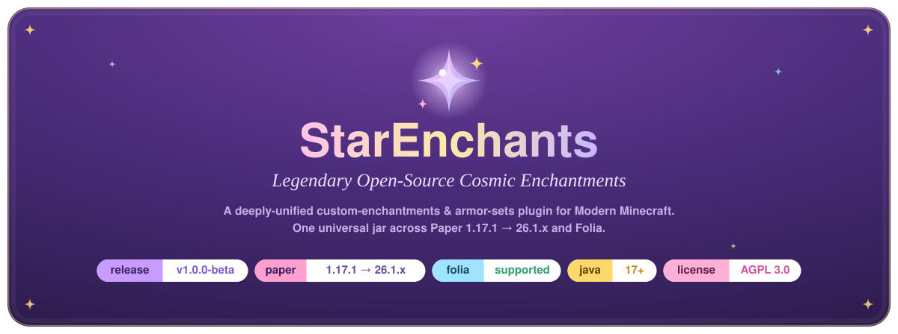

<!--
  ════════════════════════════════════════════════════════════════════════
  StarEnchants README (developer-facing)
  ────────────────────────────────────────────────────────────────────────
  All player/operator docs (install, configuration, commands, the DSL
  reference, the Enchant Creator) live on the docs site, generated from the
  engine so they never drift. This README keeps only the title card + feature
  cards and developer information.

  GitHub strips <style>/CSS, so the visual styling lives in committed SVGs
  under /assets. To change colors, titles, the logo or icons read README-GUIDE.md.
  ════════════════════════════════════════════════════════════════════════
-->

<p align="center">
  <picture>
    <source media="(prefers-color-scheme: dark)" srcset="assets/hero-dark.svg">
    
  </picture>
</p>

<p align="center">
  <a href="https://github.com/owengregson/StarEnchants/releases/latest"></a>
  &nbsp;
  <a href="https://github.com/owengregson/StarEnchants/releases"></a>
</p>

<p align="center">
  <b>Open-source cosmic enchantments for your server.</b><br>
  Enchantments, armor sets, crystals, masks, pets, and weapon reforges, all configured in plain YAML. A built-in migrator brings your old configs across.
</p>

<p align="center">
  <code>✦ 88 effects</code> &nbsp;&nbsp; <code>✦ Armor sets &amp; crystals</code> &nbsp;&nbsp; <code>✦ Souls economy</code> &nbsp;&nbsp; <code>✦ Paper + Folia</code> &nbsp;&nbsp; <code>✦ 1.8, 1.17.1-26.1.2</code>
</p>

<br>

<p align="center"></p>

<table>
<tr>
<td width="50%" valign="top">
<br>
<b>Unified effect engine</b><br>
Enchantments, armor-set bonuses, crystals, masks, pets, and weapon reforges all feed <i>one</i> engine: <b>88 effects</b>, <b>25 triggers</b>, <b>18 selectors</b>, and a conditions DSL over <b>49 live variables</b>, on top of rarity tiers, applies/targets, and per-level options (chance, cooldown, souls, condition).
</td>
<td width="50%" valign="top">
<br>
<b>Item &amp; economy systems</b><br>
Enchant books, scrolls (white, holy-white, black, transmog, godly-transmog, randomizer), success dust, soul gems and the souls economy they feed, slot-expander orbs, item nametags, crystals, weapon reforges, and right-click use-items. The pack also ships 14 masks (textured heads you drag onto a helmet for a passive ability, which re-skin the worn helmet) and 21 pets: levelling textured-head companions you carry in the hotbar, with an active or passive ability, fed on Pet Food.
</td>
</tr>
<tr>
<td width="50%" valign="top">
<br>
<b>Armor sets &amp; reforges</b><br>
Full armour sets with a set-completion bonus and an optional matched set weapon, plus Heroic upgrades that raise damage, reduction and durability. The other half of the loadout is the 10 weapon reforges: one socketable signature ability per sword or axe, fired with shift+right-click. Both are just more sources of effects feeding the same engine.
</td>
<td width="50%" valign="top">
<br>
<b>In-game GUIs</b><br>
Menus are the main way to run the plugin, and all of them are configurable. Players get nine direct commands (permission <code>starenchants.use</code>, granted to everyone by default): <code>/enchants</code> or <code>/enchanter</code> opens the Enchanter bench, where tiered mystery books cost XP levels; <code>/alchemist</code> combines two identical books into the next level; <code>/tinkerer</code> trades books back for XP; and <code>/sets</code>, <code>/crystals</code>, <code>/catalogue</code> (the Enchant Codex), <code>/pets</code> and <code>/masks</code> open the browsers. Operators still get the full console at <code>/se menu</code> to mint anything, drill into sets and reforges, and reload.
</td>
</tr>
<tr>
<td width="50%" valign="top">
<br>
<b>Integrations</b><br>
WorldGuard, Towny, Lands, SuperiorSkyblock, Factions, Vault, PlaceholderAPI, Mental, GrimAC, mcMMO, MythicMobs, ItemsAdder and Oraxen. All optional, none required.
</td>
<td width="50%" valign="top">
<br>
<b>Built-in migrator</b><br>
Your existing EliteEnchantments, EliteArmor and AdvancedEnchantments configs come straight into the unified schema with one command: <code>/se migrate</code>.
</td>
</tr>
</table>

<br>

<p align="center">
  <b>Installation, configuration, commands, the full reference &amp; an interactive Enchant Creator live on the docs site:</b>
</p>
<p align="center">
  <a href="https://owengregson.github.io/StarEnchants/"><b>owengregson.github.io/StarEnchants&nbsp;→</b></a>
</p>
<p align="center">
  <sub>The docs are generated from the engine, so they're always current. <b>The rest of this README is for developers</b> building or contributing to StarEnchants.</sub>
</p>

<br>

<p align="center"></p>

StarEnchants builds with the bundled Gradle wrapper, so there's no global toolchain to install. `scripts/build-mega-jar.sh` produces one jar that runs on Paper 1.17.1-26.1.2 and Folia (Java 17+) and on Minecraft 1.8.x (Java 8). It's a Multi-Release jar, so each server's JVM loads the bytecode tree that matches it: modern v61, or the downgraded legacy v52. `scripts/legacy-smoke.sh` gates the 1.8 tree on a real server (see [docs/legacy-1.8.9-codeshare-design.md](docs/legacy-1.8.9-codeshare-design.md)).

```bash
git clone https://github.com/owengregson/StarEnchants.git
cd StarEnchants
scripts/setup-dev.sh          # prereqs + git hooks + build (idempotent)
./gradlew build               # compile + pure unit tests
```

The shaded fat jar lands in `bootstrap/build/libs/`; drop it into any server in the range.

### Project layout

The module tree under `se/` is flat and single-segment: each module's package is one segment (`engine`, `item`, …), with sources in `src/` and tests in `test/`, never `src/main/java`. Shaded deps are relocated under their own root so the short roots never collide.

| Module | Responsibility |
| :-- | :-- |
| `schema` | the DSL grammar, `ParamSpec`/types, diagnostics |
| `compile` | YAML → an immutable `Snapshot` (the content compiler) |
| `engine` | the data-oriented runtime: systems, effects, conditions, selectors, triggers, the Sink |
| `item` | the one item-data layer: PDC codec, `ItemView` cache, `WornState`, lore render |
| `feature` | feature interactions, services, the `/se` commands, GUIs |
| `platform` | cross-version resolvers + the Folia-safe scheduling abstraction |
| `integrate` | the bundled, soft third-party integrations |
| `migrate` | the EE / EA / AE config importer |
| `pack` | the config-pack (ZIP snapshot) format |
| `bootstrap` | the Bukkit entry point + composition root (the shaded fat jar) |
| `tester` | the in-server Paper + Folia integration suites |
| `api` | the public surface: activation/reload events + the add-on SPI & `StarEnchantsApi` service (curated, on `schema`; ADR-0038) |
| `compat-folia` | the Folia scheduler shim |

### Verification gate

```bash
./gradlew build          # compile + pure unit tests, always first
scripts/run-matrix.sh    # boot real Paper AND Folia servers across the range, run the live suites
```

A green Paper run says nothing about Folia, so **both must pass fresh**. The matrix boots real servers across the whole range, which is what the universal jar rests on: a version-agnostic core, boot-time resolvers for the version-volatile surfaces, and one Folia-safe scheduling abstraction. Full procedure: **[docs/dev/verification-gate.md](docs/dev/verification-gate.md)**.

<br>

<p align="center"></p>

Every developer doc lives in one place. Start at the hub and follow the trail:

<p align="center">
  <a href="docs/dev/README.md"><b>docs/dev/ &nbsp;·&nbsp; the developer documentation hub&nbsp;→</b></a>
</p>

The hub splits into getting started, internals (how the engine works), and guides (how to extend it), all linked from the sections below. Player- and operator-facing docs (install, configuration, commands, the DSL reference, the Enchant Creator) live on the generated site at **[owengregson.github.io/StarEnchants](https://owengregson.github.io/StarEnchants/)** instead, where they can't drift from the engine.

<br>

<p align="center"></p>

The architecture is self-derived: a content compiler that lowers YAML into an immutable snapshot, and a data-oriented runtime that executes it. Read the design top down, then go to the subsystem you're touching.

- **[docs/architecture.md](docs/architecture.md)** covers the whole self-derived engine design, top to bottom.
- **[docs/decisions/](docs/decisions/)** holds the ADRs, the *why* behind every major choice.
- **[docs/glossary.md](docs/glossary.md)** defines the domain vocabulary (effect, trigger, selector, Sink, Affinity, WornState, …).

Subsystem internals:

| Doc | Covers |
| :-- | :-- |
| **[effect-engine.md](docs/dev/internals/effect-engine.md)** | stateless systems, the activation pipeline, gate order, the `Ability` record, the Sink, dispatch |
| **[item-data-model.md](docs/dev/internals/item-data-model.md)** | item state, the PDC codec, the `ItemView` cache, component stores, `WornState`, lore/name render |
| **[compiler-and-config.md](docs/dev/internals/compiler-and-config.md)** | resolve → typecheck → lower → erase → snapshot, diagnostics, transactional reload |
| **[feature-interactions.md](docs/dev/internals/feature-interactions.md)** | damage stacking, enchant/group/type suppression, souls, slots, crystals, omni/multi-set completion |
| **[cross-version-api.md](docs/dev/internals/cross-version-api.md)** | the 1.17.1 → 26.1.x surface, the 1.20.5 mapping flip, enum→registry breaks, boot-time resolvers |
| **[folia-scheduling.md](docs/dev/internals/folia-scheduling.md)** | Folia's region/entity/global thread model and the scheduling abstraction that makes one codebase correct on both |
| **[performance-hot-paths.md](docs/dev/internals/performance-hot-paths.md)** | the combat/item hot path, declared Affinity, the Sink/cache/interning, the lint + JMH gate |
| **[the-migrator.md](docs/dev/internals/the-migrator.md)** | the EE / EA / AE config importer and the legacy-item migration path |
| **[config-packs.md](docs/dev/internals/config-packs.md)** | the config-pack (ZIP snapshot) format: export, import, share |

<br>

<p align="center"></p>

Adding a feature is local: one interface plus one registration. Each how-to walks the whole loop, from declaring the kind to the live test that proves it works.

| Add a… | Guide |
| :-- | :-- |
| new **effect** | **[developing-an-effect.md](docs/dev/guides/developing-an-effect.md)** |
| new **condition** | **[developing-a-condition.md](docs/dev/guides/developing-a-condition.md)** |
| new **selector** | **[developing-a-selector.md](docs/dev/guides/developing-a-selector.md)** |
| new **trigger** | **[developing-a-trigger.md](docs/dev/guides/developing-a-trigger.md)** |
| new **DSL grammar** | **[extending-the-dsl-grammar.md](docs/dev/guides/extending-the-dsl-grammar.md)** |
| new **item type** | **[adding-an-item-type.md](docs/dev/guides/adding-an-item-type.md)** |
| new **integration** | **[adding-an-integration.md](docs/dev/guides/adding-an-integration.md)** |
| new **config option** | **[adding-a-config-option.md](docs/dev/guides/adding-a-config-option.md)** |
| new **command** | **[adding-a-command.md](docs/dev/guides/adding-a-command.md)** |

<br>

<p align="center"></p>

Contributions are welcome. The flow is **feature branch → frequent Conventional Commits → PR (CI green) → rebase-merge** (never squash). Enable the hooks once with `scripts/setup-hooks.sh`.

- **[CONTRIBUTING.md](CONTRIBUTING.md)** has the full workflow, branching model, and commit conventions.
- **[docs/dev/getting-started.md](docs/dev/getting-started.md)** covers clone-to-first-change, the dev loop, and where things live.
- **[docs/dev/verification-gate.md](docs/dev/verification-gate.md)** explains `./gradlew build` then `scripts/run-matrix.sh`, and how to read the results honestly (Paper green is not Folia green).
- **[docs/dev/writing-a-live-test.md](docs/dev/writing-a-live-test.md)** walks through authoring an in-server Paper + Folia integration test.
- **[docs/dev/regenerating-generated-docs.md](docs/dev/regenerating-generated-docs.md)**: the DSL reference and Enchant Creator are generated from the live registries, so run `./gradlew regenDocs` (a drift test fails the build if you skip it).
- **[docs/dev/release-process.md](docs/dev/release-process.md)** covers cutting a tagged release.
- **[CLAUDE.md](CLAUDE.md)** and **`.claude/skills/`** carry the engineering invariants and the hard-won, per-area knowledge to check *before* working in an area.

<br>

<p align="center"></p>

Released under the **GNU Affero General Public License v3.0** (AGPL-3.0). See [LICENSE](LICENSE).

<br>
<p align="center"></p>
<p align="center"><sub><b>STARENCHANTS</b> &nbsp;·&nbsp; made with a little starlight ✦</sub></p>
